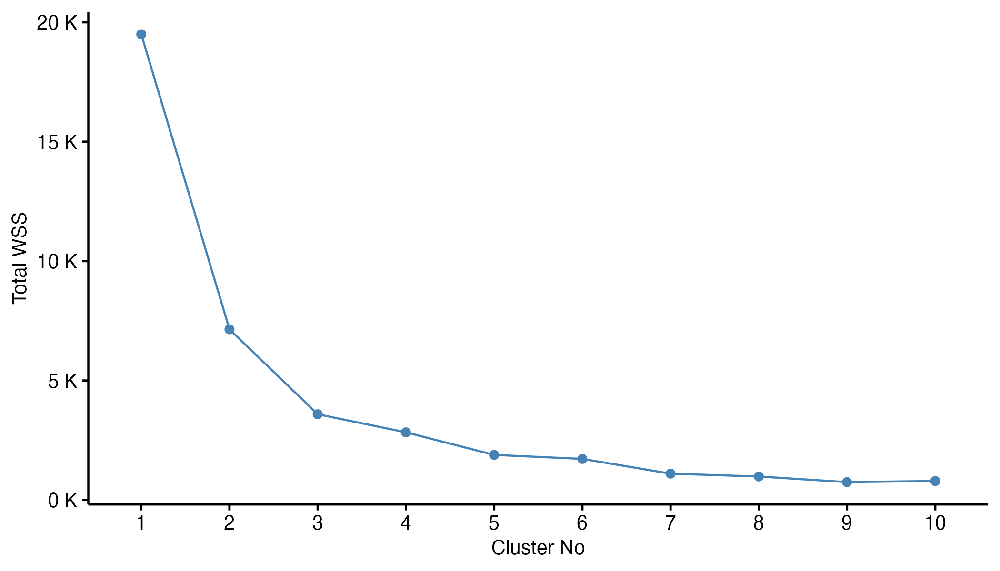
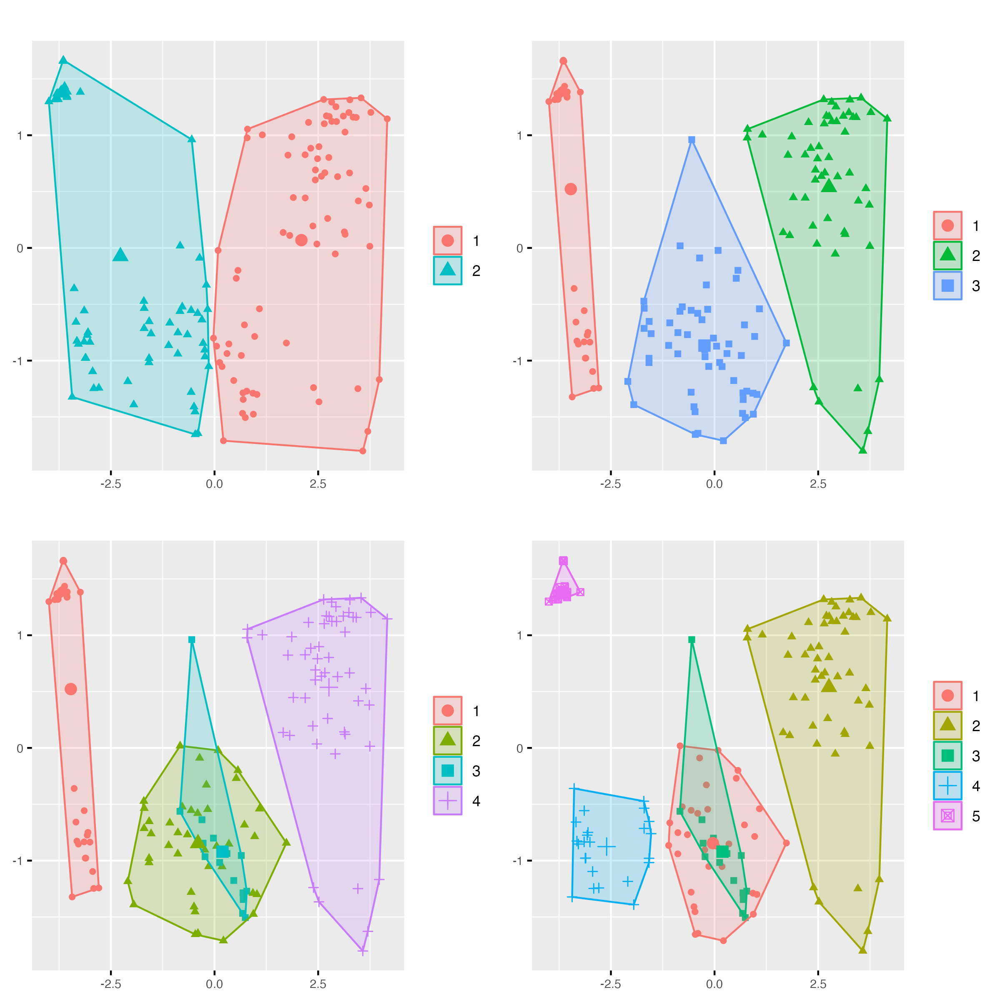

# Salmon Contamination Analysis
A comprehensive analysis of contamination levels in farmed salmon from around the world. Contamination levels vary significantly based on the variety and quantity of pesticides used for farming and agriculture in different countries.

The analysis explores the levels on 9 different contaminants and aims to inform both consumers and businesses on the best global sources of salmon. The best sources of will supply salmon with the least contaminants to reduce the harmful health effects of pesticides in produce. 

## Tools Used 
* **R Studio**: Data prep and cleaning, Principal Component Analysis, Cluster Analysis, Linear Discriminant Analysis and visualisation. 

## Overview
This analysis contains:
* Cluster analysis 
* Spatial analysis
* Principal Component Analysis (PCA)
* Density Plots 

## Analysis 

### Elbow plot

The data was first analysed to check for any grouping in the data through the use of an elbow plot. The optimal number of clusters was found using an elbow plot which plots the "Total within sum of squares" (Total WSS)  against the cluster number as shown below. The Total WSS refers to the sum of  squared differences between each point in a data set and the mean of it's respective group. As the plot shows a steep descent until 3 clusters and the addition of a fourth cluster doesn't significantly decrease the total WSS, 3 clusters seems optimal. 

### Cluster plots 

The cluster number was then checked by plotting cluster plots showing between 2 and 4 clusters to fit the data. The cluster plots confirmed that the optimal cluster number is three. The two cluster plot doesn't achieve much separation between the two groups in the data. The four cluster shows over fitting with the two clusters in the middle of the plot having significant overlap.

### Spatial analysis 

The locations of the salmon farmed are then plotted on a world map to identify groups of salmon farms which are geographically close. As shown in the cluster analysis there were 3 distinct groups identified through spatial analysis, being the continents Europe, North America and South America.  

### Principal Component Analysis 

Principle Component Analysis (PCA) is first applied to identify any trends between different salmon sources. A country based PCA shows significant overlap between countries of the same continent indicating similarly to the cluster analysis that geographically close salmon farms share similar contaminantion profiles. A continent based PCA was then used to avoid significant overlap between groups in the PCA. As shown below the continient based PCA had less overlap 

### Contaminant Density Plots

A continent based PCA shows much better group separation therefore the following analysis is conducted comparing the contamination levels in different continents. Density plots are used to examine the contamination levels present in the different continents. 

## Conclusions

* **Cleanest salmon source**: The most unpolluted salmon was sourced from South America with most contmamiant levels being close to zero
* **Most contaminated salmon source**: European salmon farms produced salmon with the highest levels in most contaminants analysed with significantly higher levels of 'Mirex' and 'Dieldrin' and 'Hexachlorobenzene'. 

## Details and Acknowledgements

### Dataset

The “farmedSalmon.csv” data file contains the contamination profiles of 153 salmon from 8 different salmon farms located in Europe, North America and South America.The levels of nine contaminants Mirex, Hexachlorobenzene, HCH gamma, Heptachlor Epoxide, Dieldrin, Endrin, Chlordane, DDT and Dioxin are examined. The salmon samples originate from 8 salmon farms around the world.

